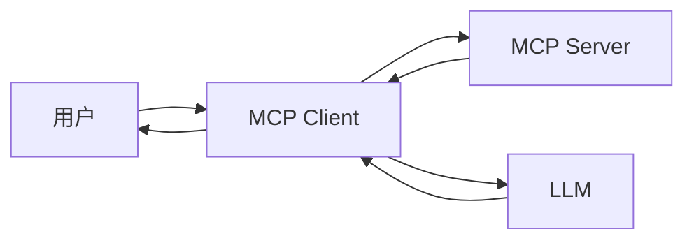

# MCP (Model Context Protocol) 总结

MCP（Model Context Protocol）是连接客户端（如 VS Code、Copilot Chat）、大语言模型（LLM）与用户工作环境的中间协议。它不仅仅转发请求，更通过丰富的上下文、工具调用和提示工程，极大提升 LLM 的智能化和实用性。

---

## 架构总览

MCP 采用典型的三层架构：

- **LLM**：负责自然语言理解与生成。
- **MCP Server**：智能中枢，负责请求解析、上下文整合、工具调用和提示构建。
- **MCP Client**：如 VS Code 插件，负责与用户交互并将请求发送到 MCP Server。

### 架构图示意

---

## 架构流程说明

1. **用户** 在 MCP Client（如 VS Code）输入指令或问题。
2. **MCP Client** 收集用户输入及本地上下文，发送到 MCP Server。
3. **MCP Server** 解析请求，结合 Resources（环境信息）、调用 Tool（工具），并用 Prompts（提示工程）构建高质量提示。
4. **LLM** 根据 MCP Server 构建的提示生成响应。
5. **MCP Server** 可对 LLM 响应进行后处理，再返回 MCP Client。
6. **MCP Client** 将最终结果展示给用户。

---

## MCP Server 的核心特性

### 1. Tool（工具）

- 让 LLM 能主动调用外部或本地工具，如：
  - `@workspace`：读取/搜索工作区文件
  - `@terminal`：执行终端命令
  - API 调用、文件操作等

### 2. Resources（资源）

- MCP Server 能访问丰富的上下文信息，包括：
  - 当前活动文件、选中代码
  - 工作区目录结构
  - 终端历史与输出
  - 用户配置与偏好

### 3. Prompts（提示工程）

- MCP Server 通过系统提示、任务模板、few-shot 示例等，规范和引导 LLM 的行为，确保输出高质量、稳定、可控。

---

## 总结

MCP 通过 Server 层的 Tool、Resources 和 Prompts，把通用的 LLM 变成懂你环境、能动手的智能助手。它让 AI 不只是“会说话”，更能“做事”，为开发者和知识工作者带来更高效的体验